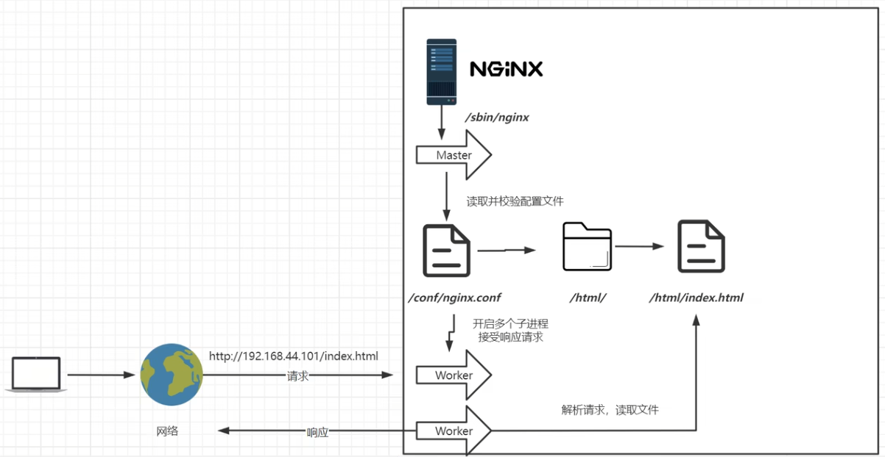

---

### 常用版本分为四大阵营

* Nginx开源版		   http://nginx.orgl

* Nginx plus商业版     https://www.nginx.com

* **Openresty**               http://openresty.org

* **Tengine**                    http://tengine.taobao.org/


### Nginx开源版安装

* 下载安装包

  * ``tar zxvf nginx---``解压
  * ```./configure --prefix=/usr/local/nginx```
  * ```--prefix```指定安装目录

* 编译安装与依赖检查

  - #### 出现问题

    提示：

    ```checking for os
    - Linux 5.14.0-70.el9.x86_64 x86_64
      checking for C compiler ... not found
    
    ./configure: error: C compiler cc is not found
    ```

    安装c语言库

    ``yum install -y gcc``

    提示：

    ```./configure: error: the http rewrite module requires the pcre library.
    You can either disable the module by using --without-http_rewrite_module
    
    option, or install the PCRE library into the system, or build the PCRE library
    
    statically from the source with nginx by using --with-pcre=<path> option.
    ```

    安装perl库

    `` yum install -y pcre pcre-devel``

    ``yum install -y zlib zlib-devel``

    接下来执行

    ```
    make
    make install
    ```

* Nginx启停

  进入安装好的目录``cd /usr/local/nginx/sbin``

  ```
  ./nginx 	       启动
  ./nginx	-s stop	   快速停止
  ./nginx	-s quit	   优雅关闭，在退出前完成已接受的连接请求
  ./nginx	-s reload  重新加载配置
  ```

  ####可能的问题

  80端口被占用

  ``ss -tnlp | grep 80``

  ``systemctl stop (httpd)``

* 关闭防火墙

  ``systemctl stop firewalld.service``

* 禁止防火墙开机启动

  ``systemctl disable firewalld.service``

* 放行端口

  ``firewall-cmd --zone=public --add-port=80/tcp --permanent``

* 重启防火墙

  ``firewall-cmd --reload``

* 安装成系统服务

  创建服务脚本

  ``vi /usr/lib/systemd/system/nginx.service``

  脚本内容

  ```shell
  [Unit]
  Description=nginx - web server
  After=network.target remote-fs.target nss-lookup.target
  
  [Service]
  Type=forking
  PIDFile=/usr/local/nginx/logs/nginx.pid
  # 启动前先测试配置文件（一行写完，避免换行）
  ExecStartPre=/usr/local/nginx/sbin/nginx -t -c /usr/local/nginx/conf/nginx.conf
  # 启动Nginx
  ExecStart=/usr/local/nginx/sbin/nginx -c /usr/local/nginx/conf/nginx.conf
  # 重新加载配置
  ExecReload=/usr/local/nginx/sbin/nginx -s reload
  # 停止Nginx（优先用quit优雅停止，失败再用stop）
  ExecStop=/usr/local/nginx/sbin/nginx -s quit
  # 备用停止方式（强制杀死进程）
  ExecStop=/bin/kill -s TERM $MAINPID
  PrivateTmp=true
  
  [Install]
  WantedBy=multi-user.target
  
  ```

  重新加载系统服务

  ``systemctl daemon-reload``

  启动服务

  ``systemctl start nginx``

  #### 开机启动

  ``systemctl enable nginx.service``

  

## 目录结构与基本运行原理

* sbin下为启动nginx文件
* conf下为核心配置文件
* html下为默认启动页面
* logs下为记录访问日志