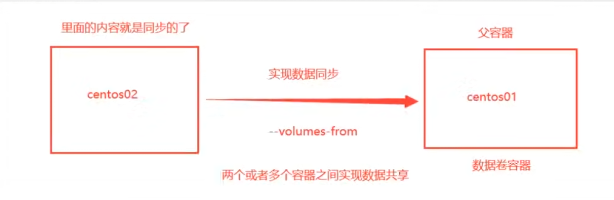

---

title: docker
weight: 10 
date: 2025-12-12
draft: false 

---

# docker

### 安装

---

linux：``yum install docker-ce docker-ce-cli containerd.io``

**docker-ce**：Docker守护进程，负责所有的容器管理工作，在 Linux 上依赖另外两个完成工作

**docker-ce-cli** ：用于控制Docker守护进程的 CLI 工具（可以通过CLI工具控制远程 Docker 守护进程）

**containerd.io** ： 守护进程与操作系统之间的接口层，本质上将Docker与操作系统分离

> containerd 可用作 Linux 和 Windows 的守护程序。 它管理其主机系统的完整容器生命周期，从图像传输和存储到容器执行和监督，再到低级存储到网络附件等等

启动docker守护进程

```shell
systemctl start docker
```

查看docker进程状态

```shell
systemctl start docker
```

卸载docker

```shell
yum remove docker-ce #卸载

rm -rf /var/lib/docker #删除镜像、容器、配置文件等内容
```


### 镜像命令

---

**docker images**  查看所有本地的主机上的镜像

```shell
[root@kuangshen /] #docker images
REPOSITORY 	 TAG	  IMAGE ID	       CREATED	     SIZE
hello-world	latest	bf756fblae65	4 months ago	13.3kB

#解释
REPOSITORY	镜像的仓库源
TAG			镜像的标签
IMAGE ID	镜像的id
CREATED		镜像的创建时间
SIZE		镜像的大小

#可选项
	-a,--a11		#列出所有镜像
	-q,--quiet		#只显示镜像的id
```

下载镜像

```shell
# 下载镜像 docker pull 镜像名[:tag]
```

 删除镜像 

```shell
docker rmi -f	#(i是image的意思)
docker rmi -f  容器id 容器id 容器id   #删除多个镜像
docker rmi -f  $(docker images -aq) #删除全部的镜像
```


### 容器命令

---

**说明：我们有了镜像才可以创建容器**
``docker pull centos``
**新建容器并启动**
``docker run[可选参数]image``
#参数说明

```shell
--name="Name"	容器名字
-d				后台方式运行
-it				使用交互方式运行，进入容器查看内容
-p				指定容器的端口 -p 8080:8080
	-p 主机端口：容器端口
	-p 容器端口
	容器端口
-P				随机指定端口

#测试并进入容器
docker -it ubuntu /bin/bash
#从容器退回主机
exit
```

**列出所有的运行的容器**

```shell
# docker ps 命令
-a  #列出当前正在运行的容器+带出历史运行过的容器
-n=?  #显示最近创建的容器
-q  #只显示容器的编号
```

**退出容器**

```shell
exit  #直接容器停止并退出
CTRL + P + Q  #容器不停止退出

#再次进入容器
docker exec -it name/id /bin/bash
```

**删除容器**

```shell
docker rm 容器id			#删除指定容器，不能删除正在运行的容器，如果要强制删除 rm -rf
docker rm -f $(docker ps -aq) #删除所有容器
docker ps-a-q|xargs docker rm #删除所有的容器
```

**启动和停止容器的操作**

```shell
docker start 容器id		#启动容器
docker restart 容器id		#重启容器
docker stop 容器id		#停止当前正在运行的容器
docker kill 容器id		#强制停止当前容器
```


### 常用其他命令

**后台启动**

```shell
#命令docker run -d 镜像名
docker run -d ubuntu

#问题docker ps,发现ubuntu停止了

#常见的坑：docker容器使用后台运行，就必须要有要一个前台进程，docker发现没有应用，就会自动停止

#ngin×,容器启动后，发现自己没有提供服务，就会立刻停止，就是没有程序了
```

**查看日志**

```shell
docker logs -f -t --tail 容器，没有日志

#显示日志
-tf				#显示日志
--tai1 number	#要显示日志条数
docker logs -tf --tail 10 dce7b86171bf
```

**查看容器中的进程信息 **ps

```shell
#命令 docker top 容器id
# docker top eb4f02f782e9
```

**查看镜像的元数据**

```shell
docker inspect 容器id

# 测试
[
    {
        "Id": "eb4f02f782e94f72d26a9469268cb71643fee45df12863751f7d43cf44c56206",
        "Created": "2026-03-16T07:31:46.117978975Z",
        "Path": "/bin/bash",
        "Args": [],
        "State": {
            "Status": "running",
            "Running": true,
            "Paused": false,
            "Restarting": false,
            "OOMKilled": false,
            "Dead": false,
            "Pid": 939674,
            "ExitCode": 0,
            "Error": "",
            "StartedAt": "2026-03-16T07:31:46.156823581Z",
            "FinishedAt": "0001-01-01T00:00:00Z"
        },
        "Image": "sha256:bbdabce66f1b7dde0c081a6b4536d837cd81dd322dd8c99edd68860baf3b2db3",
        "ResolvConfPath": "/var/lib/docker/containers/eb4f02f782e94f72d26a9469268cb71643fee45df12863751f7d43cf44c56206/resolv.conf",
        "HostnamePath": "/var/lib/docker/containers/eb4f02f782e94f72d26a9469268cb71643fee45df12863751f7d43cf44c56206/hostname",
        "HostsPath": "/var/lib/docker/containers/eb4f02f782e94f72d26a9469268cb71643fee45df12863751f7d43cf44c56206/hosts",
        "LogPath": "",
        "Name": "/determined_ride",
        "RestartCount": 0,
        "Driver": "overlay2",
        "Platform": "linux",
        "MountLabel": "",
        "ProcessLabel": "",
        "AppArmorProfile": "",
        "ExecIDs": null,
        "HostConfig": {
            "Binds": null,
            "ContainerIDFile": "",
            "LogConfig": {
                "Type": "journald",
                "Config": {}
            },
            "NetworkMode": "bridge",
            "PortBindings": {},
            "RestartPolicy": {
                "Name": "no",
                "MaximumRetryCount": 0
            },
            "AutoRemove": false,
            "VolumeDriver": "",
            "VolumesFrom": null,
            "ConsoleSize": [
                37,
                62
            ],
            "CapAdd": null,
            "CapDrop": null,
            "CgroupnsMode": "private",
            "Dns": [],
            "DnsOptions": [],
            "DnsSearch": [],
            "ExtraHosts": null,
            "GroupAdd": null,
            "IpcMode": "private",
            "Cgroup": "",
            "Links": null,
            "OomScoreAdj": 0,
            "PidMode": "",
            "Privileged": false,
            "PublishAllPorts": false,
            "ReadonlyRootfs": false,
            "SecurityOpt": null,
            "UTSMode": "",
            "UsernsMode": "",
            "ShmSize": 67108864,
            "Runtime": "runc",
            "Isolation": "",
            "CpuShares": 0,
            "Memory": 0,
            "NanoCpus": 0,
            "CgroupParent": "",
            "BlkioWeight": 0,
            "BlkioWeightDevice": [],
            "BlkioDeviceReadBps": [],
            "BlkioDeviceWriteBps": [],
            "BlkioDeviceReadIOps": [],
            "BlkioDeviceWriteIOps": [],
            "CpuPeriod": 0,
            "CpuQuota": 0,
            "CpuRealtimePeriod": 0,
            "CpuRealtimeRuntime": 0,
            "CpusetCpus": "",
            "CpusetMems": "",
            "Devices": [],
            "DeviceCgroupRules": null,
            "DeviceRequests": null,
            "MemoryReservation": 0,
            "MemorySwap": 0,
            "MemorySwappiness": null,
            "OomKillDisable": null,
            "PidsLimit": null,
            "Ulimits": [
                {
                    "Name": "nofile",
                    "Hard": 1048576,
                    "Soft": 1048576
                }
            ],
            "CpuCount": 0,
            "CpuPercent": 0,
            "IOMaximumIOps": 0,
            "IOMaximumBandwidth": 0,
            "MaskedPaths": [
                "/proc/asound",
                "/proc/acpi",
                "/proc/interrupts",
                "/proc/kcore",
                "/proc/keys",
                "/proc/latency_stats",
                "/proc/timer_list",
                "/proc/timer_stats",
                "/proc/sched_debug",
                "/proc/scsi",
                "/sys/firmware",
                "/sys/devices/virtual/powercap"
            ],
            "ReadonlyPaths": [
                "/proc/bus",
                "/proc/fs",
                "/proc/irq",
                "/proc/sys",
                "/proc/sysrq-trigger"
            ]
        },
        "GraphDriver": {
            "Data": {
                "ID": "eb4f02f782e94f72d26a9469268cb71643fee45df12863751f7d43cf44c56206",
                "LowerDir": "/var/lib/docker/overlay2/d6d57af9633a037dd370075aafd79b2ad1a86e367f034c56346abc83d3093f58-init/diff:/var/lib/docker/overlay2/bc3595e86754f83707ce0d94ffed323fbd7ce99b13d7c6a1f46c1b7d168f4810/diff",
                "MergedDir": "/var/lib/docker/overlay2/d6d57af9633a037dd370075aafd79b2ad1a86e367f034c56346abc83d3093f58/merged",
                "UpperDir": "/var/lib/docker/overlay2/d6d57af9633a037dd370075aafd79b2ad1a86e367f034c56346abc83d3093f58/diff",
                "WorkDir": "/var/lib/docker/overlay2/d6d57af9633a037dd370075aafd79b2ad1a86e367f034c56346abc83d3093f58/work"
            },
            "Name": "overlay2"
        },
        "Mounts": [],
        "Config": {
            "Hostname": "eb4f02f782e9",
            "Domainname": "",
            "User": "",
            "AttachStdin": true,
            "AttachStdout": true,
            "AttachStderr": true,
            "Tty": true,
            "OpenStdin": true,
            "StdinOnce": true,
            "Env": [
                "PATH=/usr/local/sbin:/usr/local/bin:/usr/sbin:/usr/bin:/sbin:/bin"
            ],
            "Cmd": [
                "/bin/bash"
            ],
            "Image": "bbdabce66f1b",
            "Volumes": null,
            "WorkingDir": "",
            "Entrypoint": null,
            "OnBuild": null,
            "Labels": {
                "org.opencontainers.image.ref.name": "ubuntu",
                "org.opencontainers.image.version": "24.04"
            }
        },
        "NetworkSettings": {
            "Bridge": "",
            "SandboxID": "081b9b1d6861aa752c157577cdb2f08983261cfc2eced37541200a0b0a242e7b",
            "SandboxKey": "/var/run/docker/netns/081b9b1d6861",
            "Ports": {},
            "HairpinMode": false,
            "LinkLocalIPv6Address": "",
            "LinkLocalIPv6PrefixLen": 0,
            "SecondaryIPAddresses": null,
            "SecondaryIPv6Addresses": null,
            "EndpointID": "dd50aa205dea7bf9fc26cdd6f338c2617d18df363c46cbfc380aad2c85dae10c",
            "Gateway": "172.17.0.1",
            "GlobalIPv6Address": "",
            "GlobalIPv6PrefixLen": 0,
            "IPAddress": "172.17.0.2",
            "IPPrefixLen": 16,
            "IPv6Gateway": "",
            "MacAddress": "92:dd:75:58:9a:75",
            "Networks": {
                "bridge": {
                    "IPAMConfig": null,
                    "Links": null,
                    "Aliases": null,
                    "MacAddress": "92:dd:75:58:9a:75",
                    "DriverOpts": null,
                    "GwPriority": 0,
                    "NetworkID": "dea7c5c8d4570244c18725b431769ddf3f4c4d81ba9c5744af7040d4edd40e75",
                    "EndpointID": "dd50aa205dea7bf9fc26cdd6f338c2617d18df363c46cbfc380aad2c85dae10c",
                    "Gateway": "172.17.0.1",
                    "IPAddress": "172.17.0.2",
                    "IPPrefixLen": 16,
                    "IPv6Gateway": "",
                    "GlobalIPv6Address": "",
                    "GlobalIPv6PrefixLen": 0,
                    "DNSNames": null
                }
            }
        }
    }
]
```

**进入当前正在运行的容器**

```shell
#命令1
docker exec -it 容器id  /bin/bash
# 进入容器后开启一个新的终端，可以在里而操作（常用）
#命令2
docker attach 容器id  /bin/bash
# 进入容器正在执行的终端，不会启动新的进程！
```

**从容器内拷贝文件到主机上**

```shell
docker cp 容器id:容器内路径  目的的主机路径
docker cp eb4f02f782e9:/home/zrzr.txt /root/

```


### 作业练习

> docker 安装nginx

```shell
#1、搜索镜像
#2、下载镜像	pull
#3、运行测试
docker run -d --name nginx01 -p 3344:80 nginx
# -d	后台运行
# --name	给容器命名
# -p	宿主机端口：容器内部储口
```

---


### commit镜像

---

```shell
docker commit 提交容器成为一个副本

#命令和git原理类似
docker commit -m=“提交的描述信息” -a=“作者” 容器id 目标镜像名，[TAG]

docker commit -a="zr" -m="add webapps" bcc57c8214e9 tomcat02:1.0
```

``如果你想要保存当前容器的状态，就可以通过commit:来提交，获得一个镜像,相当于linux的快照``


### 容器数据卷

---

 **总结一句话：容器的持久化和同步操作！容器间也是可以数据共享的！**


#### 使用数据卷

---

> 方式一：直接使用命令来挂载  -v

```shell
docker run -it -v /home/cesh:/home centos /bin/bash

-v  本机目录:容器里的目录
```

每次启动时都要输入-v来挂载文件，不然docker关闭后文件也会消失

**好处：**我们以后修改只需要在本地修改即可，容器内会自动同步！


### 实战：安装Mysql

MYSQL的数据持久化的问题！

```shell
#获取镜像
docker pull mysql:lasted

#运行容器，需要做数据挂载！#安装启动mysq1,需要配置密码的，这是要注意点！
#官方测试：docker run --name some-mysq1    -e MYSQL_RO0T_PASSWORD=my-secret-pw -d mysql:tag

#启动
-d 后台运行
-p 端口映射
-V 卷挂载
-e 环境配置
-name 容器名字
# docker run -d -p 3310:3306 -v /home/mysql/conf:/etc/mysql/conf.d -v /home/mysql/data:/var/lib/mysql -e MYSQL_ROOT_PASSWORD=123456 --name mysql01 mysql
```


### 具名和匿名挂载

```shell
# 匿名挂载
-V 容器内路径！
docker run -d-p --name nginx01-v/ect/nginx nginx
#查看所有的vo1ume的情况
# docker volume 1s
local           9f38292179faa178afcce54d80be99d4ddd68c91d2a68870bcece72d2b7ed061

# 这里发现，这种就是匿名挂载，我们在-V只写了容器内的路径，没有写容器外的路径！

# 具名挂载
# docker run -d-p --name nginx02 -v juming-nginx:/etc/nginx nginx

# docker volume ls
DRIVER		VOLUME NAME
local		juming-nginx
# 通过-V	   卷名：容器内路径
```

所有的docker容器内的卷，没有指定目录的情况下都是在
/var/lib/docker/volumes/xxxx/_data


我们通过具名挂载可以方便的找到我们的一个卷，大多数情况在使用的`具名挂载`

```shell
#如何确定是具名挂载还是匿名挂载，还是指定路径挂载！
-V 容器内路径	 	  #匿名挂载
-V 卷名：容器内路径		#具名挂载
-v /宿主机路径:/容器内路径	#指定路径挂载！
```

```shell
#通过 -v 容器内路径：ro rw改变读写权限
ro readOnly
rw readWrite

#一旦设置了容器权限，容器对我们挂载出的内容就有限定了！
docker run -d -P --name nginx02 -v juming-nginx:/etc/nginx:ro nginx
docker run -d -P --name nginx02 -v juming-nginx:/etc/nginx:rw nginx

# ro 只能通过宿主机进行操作，容器内无法操作！
```


### 初识Dockerfile

Dockerfile就是用来构docker镜像的构建文件！命令脚本！

> 方式二：

测试：

vim Dockerfile（创建一个文件）

```shell
FROM centos
VOLUME ["volume01","volume02"]
CMD echo "----end----"
CMD /bin/bash
```

docker build -f Dockerfile -t zr/centos . (创建镜像)

```shell
-f 文件名
-t 镜像名
.  #最后有个.
```

 

### 数据卷容器

---

多个mysql同步数据!



```shell
docker run -it --name zr02 --volumes-from zr01 zr/centos

--volumes-from 		#数据共享
```


### Dockerfile

dockerfile是用来构建dokcer镜像的文件！命令参数脚本！

构建步骤：

1. 编写一个dockerfile 文件
2. docker build 构建成为一个镜像
3. docker run 运行镜像
4. docker push 发布镜像（DockerHub、阿里云镜像仓库）


### DockerFile指令

---

 

| Dockerfile 指令 | 说明                                                         |
| --------------- | ------------------------------------------------------------ |
| FROM            | 指定基础镜像，用于后续的指令构建。                           |
| LABEL           | 添加镜像的元数据，使用键值对的形式。                         |
| RUN             | 在构建过程中在镜像中执行命令。                               |
| CMD             | 指定容器创建时的默认命令。（可以被覆盖）                     |
| ENTRYPOINT      | 设置容器创建时的主要命令。（不可被覆盖）                     |
| EXPOSE          | 声明容器运行时监听的特定网络端口。                           |
| ENV             | 在容器内部设置环境变量。                                     |
| ADD             | 将文件、目录或远程URL复制到镜像中。                          |
| COPY            | 将文件或目录复制到镜像中。                                   |
| VOLUME          | 为容器创建挂载点或声明卷。                                   |
| WORKDIR         | 设置后续指令的工作目录。                                     |
| USER            | 指定后续指令的用户上下文。                                   |
| ARG             | 定义在构建过程中传递给构建器的变量，可使用 "docker build" 命令设置。 |
| ONBUILD         | 当该镜像被用作另一个构建过程的基础时，添加触发器。           |
| STOPSIGNAL      | 设置发送给容器以退出的系统调用信号。                         |
| HEALTHCHECK     | 定义周期性检查容器健康状态的命令。                           |
| SHELL           | 覆盖Docker中默认的shell，用于RUN、CMD和ENTRYPOINT指令。      |

---

> CMD和ENTRYPOINT区别

```shell
CMD
#指定这个容器启动的时候要运行的命令，只有最后一个会生效，可被替 代
ENTRYPOINT
#指定这个容器启动的时候要运行的命令，可以追加命令
```

**ENTRYPOINT**：**不变的主程序**，传参只当「入参」；

**CMD**：**可变的参数**，传参就被「替换」；

搭配用：**ENTRYPOINT 搭骨架，CMD 填默认，run 传参改默认**。

---

### COPY

复制指令，从上下文目录中复制文件或者目录到容器里指定路径。

格式：

```
COPY [--chown=<user>:<group>] <源路径1>...  <目标路径>
COPY [--chown=<user>:<group>] ["<源路径1>",...  "<目标路径>"]
```

**[--chown=<user>:<group>]**：可选参数，用户改变复制到容器内文件的拥有者和属组。

**<源路径>**：源文件或者源目录，这里可以是通配符表达式，其通配符规则要满足 Go 的 filepath.Match 规则。例如：

```
COPY hom* /mydir/
COPY hom?.txt /mydir/
```

**<目标路径>**：容器内的指定路径，该路径不用事先建好，路径不存在的话，会自动创建。

### ADD

ADD 指令和 COPY 的使用格类似（同样需求下，官方推荐使用 COPY）。功能也类似，不同之处如下：

- ADD 的优点：在执行 <源文件> 为 tar 压缩文件的话，压缩格式为 gzip, bzip2 以及 xz 的情况下，会自动复制并解压到 <目标路径>。
- ADD 的缺点：在不解压的前提下，无法复制 tar 压缩文件。会令镜像构建缓存失效，从而可能会令镜像构建变得比较缓慢。具体是否使用，可以根据是否需要自动解压来决定。

### CMD

类似于 RUN 指令，用于运行程序，但二者运行的时间点不同:

- CMD 在docker run 时运行。
- RUN 是在 docker build。

**作用**：为启动的容器指定默认要运行的程序，程序运行结束，容器也就结束。CMD 指令指定的程序可被 docker run 命令行参数中指定要运行的程序所覆盖。

**注意**：如果 Dockerfile 中如果存在多个 CMD 指令，仅最后一个生效。

格式：

```
CMD <shell 命令> 
CMD ["<可执行文件或命令>","<param1>","<param2>",...] 
CMD ["<param1>","<param2>",...]  # 该写法是为 ENTRYPOINT 指令指定的程序提供默认参数
```

推荐使用第二种格式，执行过程比较明确。第一种格式实际上在运行的过程中也会自动转换成第二种格式运行，并且默认可执行文件是 sh。

### ENTRYPOINT

类似于 CMD 指令，但其不会被 docker run 的命令行参数指定的指令所覆盖，而且这些命令行参数会被当作参数送给 ENTRYPOINT 指令指定的程序。

但是, 如果运行 docker run 时使用了 --entrypoint 选项，将覆盖 ENTRYPOINT 指令指定的程序。

**优点**：在执行 docker run 的时候可以指定 ENTRYPOINT 运行所需的参数。

**注意**：如果 Dockerfile 中如果存在多个 ENTRYPOINT 指令，仅最后一个生效。

格式：

```
ENTRYPOINT ["<executeable>","<param1>","<param2>",...]
```

可以搭配 CMD 命令使用：一般是变参才会使用 CMD ，这里的 CMD 等于是在给 ENTRYPOINT 传参，以下示例会提到。

示例：

假设已通过 Dockerfile 构建了 nginx:test 镜像：

```
FROM nginx

ENTRYPOINT ["nginx", "-c"] # 定参
CMD ["/etc/nginx/nginx.conf"] # 变参 
```

1、不传参运行

```
$ docker run  nginx:test
```

容器内会默认运行以下命令，启动主进程。

```
nginx -c /etc/nginx/nginx.conf
```

2、传参运行

```
$ docker run  nginx:test -c /etc/nginx/new.conf
```

容器内会默认运行以下命令，启动主进程(/etc/nginx/new.conf:假设容器内已有此文件)

```
nginx -c /etc/nginx/new.conf
```

### ENV

设置环境变量，定义了环境变量，那么在后续的指令中，就可以使用这个环境变量。

格式：

```
ENV <key> <value>
ENV <key1>=<value1> <key2>=<value2>...
```

以下示例设置 NODE_VERSION = 7.2.0 ， 在后续的指令中可以通过 $NODE_VERSION 引用：

```
ENV NODE_VERSION 7.2.0

RUN curl -SLO "https://nodejs.org/dist/v$NODE_VERSION/node-v$NODE_VERSION-linux-x64.tar.xz" \
  && curl -SLO "https://nodejs.org/dist/v$NODE_VERSION/SHASUMS256.txt.asc"
```

### ARG 

构建参数，与 ENV 作用一致。不过作用域不一样。ARG 设置的环境变量仅对 Dockerfile 内有效，也就是说只有 docker build 的过程中有效，构建好的镜像内不存在此环境变量。

构建命令 docker build 中可以用 --build-arg <参数名>=<值> 来覆盖。

格式：

```
ARG <参数名>[=<默认值>]
```

### VOLUME

定义匿名数据卷。在启动容器时忘记挂载数据卷，会自动挂载到匿名卷。

作用：

- 避免重要的数据，因容器重启而丢失，这是非常致命的。
- 避免容器不断变大。

格式：

```
VOLUME ["<路径1>", "<路径2>"...]
VOLUME <路径>
```

在启动容器 docker run 的时候，我们可以通过 -v 参数修改挂载点。

### EXPOSE 

仅仅只是声明端口。

作用：

- 帮助镜像使用者理解这个镜像服务的守护端口，以方便配置映射。
- 在运行时使用随机端口映射时，也就是 docker run -P 时，会自动随机映射 EXPOSE 的端口。

格式：

```
EXPOSE <端口1> [<端口2>...]
```

### WORKDIR

指定工作目录。用 WORKDIR 指定的工作目录，会在构建镜像的每一层中都存在。以后各层的当前目录就被改为指定的目录，如该目录不存在，WORKDIR 会帮你建立目录。

docker build 构建镜像过程中的，每一个 RUN 命令都是新建的一层。只有通过 WORKDIR 创建的目录才会一直存在。

格式：

```
WORKDIR <工作目录路径>
```

### USER 

用于指定执行后续命令的用户和用户组，这边只是切换后续命令执行的用户（用户和用户组必须提前已经存在）。

格式：

```
USER <用户名>[:<用户组>]
```

### HEALTHCHECK

用于指定某个程序或者指令来监控 docker 容器服务的运行状态。

格式：

```
HEALTHCHECK [选项] CMD <命令>：设置检查容器健康状况的命令
HEALTHCHECK NONE：如果基础镜像有健康检查指令，使用这行可以屏蔽掉其健康检查指令

HEALTHCHECK [选项] CMD <命令> : 这边 CMD 后面跟随的命令使用，可以参考 CMD 的用法。
```

### ONBUILD 

用于延迟构建命令的执行。简单的说，就是 Dockerfile 里用 ONBUILD 指定的命令，在本次构建镜像的过程中不会执行（假设镜像为 test-build）。当有新的 Dockerfile 使用了之前构建的镜像 FROM test-build ，这时执行新镜像的  Dockerfile 构建时候，会执行 test-build 的 Dockerfile 里的 ONBUILD 指定的命令。

格式：

```
ONBUILD <其它指令>
```

### LABEL

LABEL 指令用来给镜像添加一些元数据（metadata），以键值对的形式，语法格式如下：

```
LABEL <key>=<value> <key>=<value> <key>=<value> ...
```

比如我们可以添加镜像的作者：

``` 
LABEL org.opencontainers.image.authors="runoob"
```


---

### 实战：Tomcat镜像


---

### 发布镜像到Dockerhub

```shell
docker tag 镜像id  dockerHub注册名/镜像名称:1.0
docker push  dockerHub注册名/镜像名称:1.0
```

---


### Docker 网络

---

#### 多容器通信 

参考：https://docker.easydoc.net/doc/81170005/cCewZWoN/U7u8rjzF

一个项目不是独立运行，可能会依赖多个软件，比如：一个web项目需要mysql数据库、redis等，这就需要多容器之间相互通信

容器之间独立，但是每个容器都可以直接访问其他容器的IP。原理如图：


图中的三个容器可以相互ping通是因为有Docker0存在（Docker0相当于一个路由器或者网关），三个容器是以Docker0为中介。每新建一个容器就会出现一个成对存在的网卡，新建容器如果没有指定网络那么默认会在docker0下

> Veth：可以简单理解成虚拟网卡，新容器后其总是成对出现，一端发送数据，另一端就能接收

案例：

```
# redis容器
docker run -d --name redis-container -p 6379:6379 -v /redisData:/data redis:latest

# mysql容器
docker run -d --name mysql-container -p 3306:3306 -v /mysqlData:/var/lib/mysql  -e MYSQL_ROOT_PASSWORD=hedaodao mysql:latest

# docker运行后端服务项目会发现 mysql、redis如果配置 host:127.0.0.1 会报错
# 这是因为 127.0.0.1 被认为是容器内的地址，肯定找不到mysql、redis
# ip addr 查看下机器IP，将服务地址换为机器IP才行
```

---

####  **--docker network**

---

> 我们编写了一个微服务，database url=ip:,项目不重启，数据库ip换掉了，我们希望可以处理这个问题，可以名字来进行访问容器？

* 步骤 1：创建自定义网络

```bash
docker network create my-net
```

* 步骤 2：把容器都加入这个网络

```bash
# 启动 tomcat 并加入 my-net 网络
docker run -d --name tomcat01 --network my-net tomcat

# 启动另一个容器（比如 mysql）也加入同一个网络
docker run -d --name mysql01 --network my-net mysql
```

* 步骤 3：直接用【容器名】互相访问

```bash
# 在 tomcat 容器里可以直接 ping mysql
docker exec -it tomcat01 ping mysql01
```

---

### 网络连通(connect)

```shell
#一个容器连上另一个网络
docker network connect my-net tomcat01

# docker network connect [OPTIONS] NETWORK CONTAINER
```

```shell
# 测试打通tomcat01-mynet
# 连通之后就是将tomcat01放到了mynet网络下
# 一个容器两个ip地址！  
# 阿里云服务：公网ip 私网ip
```


---

### 实战：部署Redis集群
