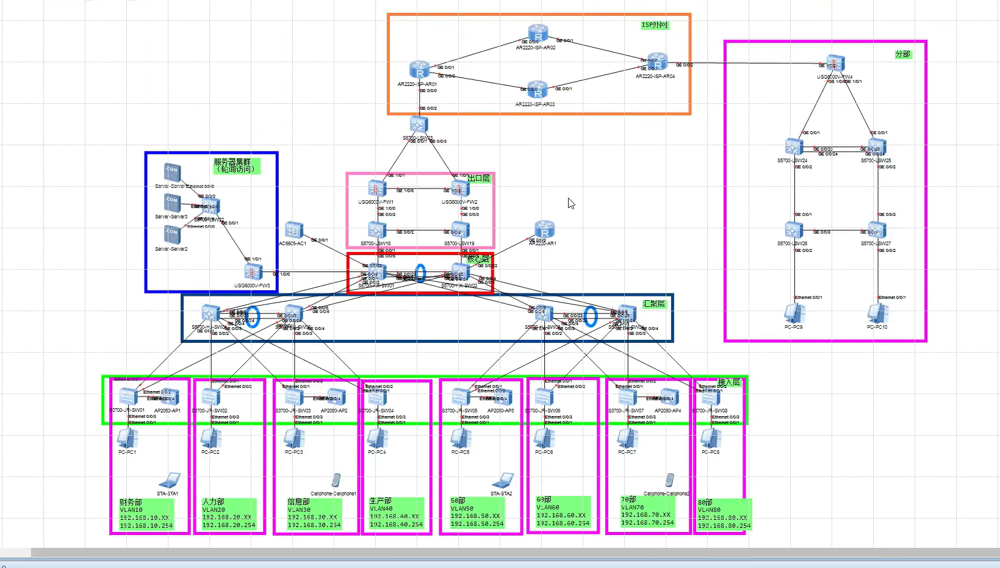
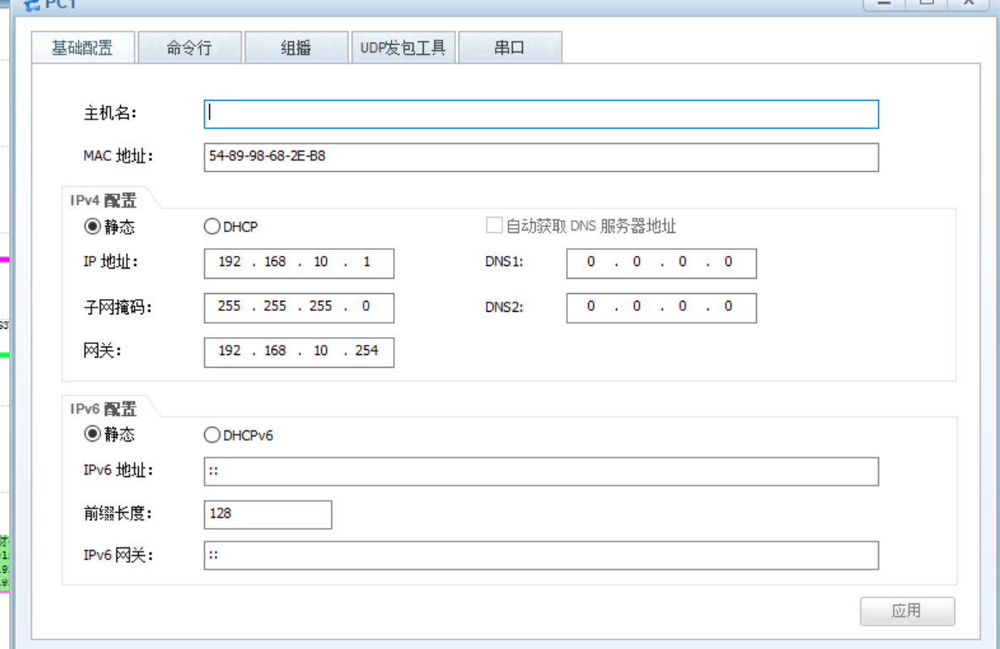
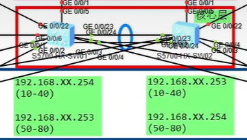
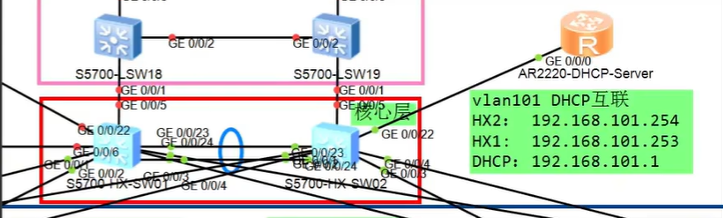

# 


# ensp实战

## 一. 拓扑搭建



## 二. 内网搭建—修改设备名称

```SHELL
SY
SYSNAME JR-SW01
```


## 三. 内网搭建—eth链路聚合

```shell
SY	
int Eth-Trunk 1	
port link-type trunk 
port trunk allow-pass vlan all
mode lacp-static
q
int g0/0/23	
eth-trunk 1
q
int g0/0/24	
eth-trunk 1
q
```

```shell
SY                          
int Eth-Trunk 1             # 创建并进入编号1的链路聚合组
port link-type trunk        # 将聚合组接口类型配置为Trunk，用于跨VLAN互联
port trunk allow-pass vlan all  # 允许所有VLAN数据通过该聚合链路
mode lacp-static                # 配置聚合组工作模式为LACP动态协商模式
q                        
int g0/0/23                
eth-trunk 1                 # 将G0/0/23加入Eth-Trunk 1聚合组
q                          
int g0/0/24               
eth-trunk 1                 # 将G0/0/24加入Eth-Trunk 1聚合组
q                          
```

```shell
//检测结果
Eth-Trunk1's state information is:
Local:
LAG ID: 1                   WorkingMode: STATIC                               
Preempt Delay: Disabled     Hash arithmetic: According to SIP-XOR-DIP         
System Priority: 32768      System ID: 4c1f-cc17-77d9                         
Least Active-linknumber: 1  Max Active-linknumber: 8                          
Operate status: up          Number Of Up Port In Trunk: 2                     
--------------------------------------------------------------------------------
ActorPortName          Status   PortType PortPri PortNo PortKey PortState Weight
GigabitEthernet0/0/23  Selected 1GE      32768   24     305     10111100  1     
GigabitEthernet0/0/24  Selected 1GE      32768   25     305     10111100  1     

Partner:
--------------------------------------------------------------------------------
ActorPortName          SysPri   SystemID        PortPri PortNo PortKey PortState
GigabitEthernet0/0/23  32768    4c1f-cc90-5ebb  32768   24     305     10111100
GigabitEthernet0/0/24  32768    4c1f-cc90-5ebb  32768   25     305     10111100
    
[HJ-SW02] User interface con0 is available
```


## 四. 内网搭建–vlan接入

接入终端的地方配置access

交换机和交换机之间配置trunk（并允许访问所有vlan）

access模式

```shell  
sy
vlan batch 80  100
interface Ethernet 0/0/3
port link-type access
port default vlan 80
```

```shell
[JR-SW01]vlan batch 10 100
[JR-SW01]int e0/0/3
[JR-SW01-Ethernet0/0/3]port link-type access 
[JR-SW01-Ethernet0/0/3]port default vlan 10
```

trunk模式

```shell
interface Ethernet 0/0/1
port link-type trunk
port trunk allow-pass vlan all
interface Ethernet 0/0/2
port link-type trunk
port trunk allow-pass vlan all
```

批量创建

```shell
port-group  group-member g0/0/1 to g0/0/6
port link-type trunk
port trunk allow-pass vlan all
```


## 五. 内网搭建—MSTP

#### 步骤 1：所有交换机先创建需要的 VLAN

```
vlan batch 10 20 30 40 50 60 70 80 100
```

#### 步骤 2：配置链路聚合 + Trunk 放行 VLAN

1. 创建聚合口、LACP 模式、配置 Trunk

```
int Eth-Trunk 1
 mode lacp-static
 port link-type trunk
 port trunk allow-pass vlan 10 20 30 40 50 60 70 80 100
quit
```

#### 步骤 3：所有交换机配置

```bash
stp region-configuration
 region-name qq        # 域名全网统一
 revision-level 10     
 # VLAN和实例绑定全网统一
 instance 1 vlan 10 20 30 40
 instance 2 vlan 50 60 70 80
 active region-configuration   # 必敲！激活生效
quit
```

#### 步骤 4：配置实例根桥

**核心 SW01**

```
stp instance 1 root primary   # 实例1 主根
stp instance 2 root secondary  # 实例2 备根
```

**接入 SW02**

```
stp instance 1 root secondary  # 实例1 备根
stp instance 2 root primary   # 实例2 主根
```

#### 步骤 5：验证查看

1. 查看 MST 域配置是否一致

```
display stp region-configuration
```

1. 查看生成树实例状态（接入交换机能看到 MSTID 0 1 2）

```
display stp brief
```


## 六. 内网搭建—配置静态IP

 

##  七. 内网搭建—VRRP

```shell
[HX-SW01]int Vlanif 10
[HX-SW01-Vlanif10]ip add 192.168.10.253 24
[HX-SW01-Vlanif10]vrrp vrid 1 virtual-ip 192.168.10.254
[HX-SW01-Vlanif10]vrrp vrid 1 priority 130
```


```
核心1：
int Vlanif 40
ip address 192.168.40.254 24 
vrrp vrid 4 virtual-ip 192.168.40.254 
vrrp vrid 4 priority 130

int Vlanif 80
ip address 192.168.80.253 24 
vrrp vrid 8 virtual-ip 192.168.80.254 
```


    核心2：
    int Vlanif 40
    ip address 192.168.40.253 24 
    vrrp vrid 4 virtual-ip 192.168.40.254 
    
    int Vlanif 80
    ip address 192.168.80.254 24 
    vrrp vrid 8 virtual-ip 192.168.80.254 
    vrrp vrid 8 priority 130



# 八. DHCP



```
HX-01:
vlan 101
int vlanif 101
ip address 192.168.101.253 24

HX-02:
vlan 101
int vlanif 101
ip address 192.168.101.254 24

[HX-SW02]int GigabitEthernet 0/0/22
[HX-SW02-GigabitEthernet0/0/22]port link-type access 
[HX-SW02-GigabitEthernet0/0/22]port default vlan 101
```

```
DHCP enable									#开启全局dhcp
int g 0/0/0
ip add 192.168.101.1 24
dhcp select global							#将dhcp服务器接口改为全局模式	

dhcp pool vlan10							#创建dhcp地址池
network 192.168.10.0 mask 255.255.255.0		#网段范围
default-gateway 192.168.10.254				#指定网关
dns-list 223.5.5.5 114.114.114.114			#指定DNS
lease day 1 hour 0 minute 0					#地址租期
excluded-ip-address 192.168.10.253 192.168.10.254	#除去已用地址

ip route-static 0.0.0.0 0.0.0.0 192.168.1.1			#配置默认路由
```

**dhcp中继**

Vlanif10、20…80 全部一样写法

```
dhcp enable

int Vlanif 10
dhcp select relay
dhcp relay server-ip 192.168.101.1
```

