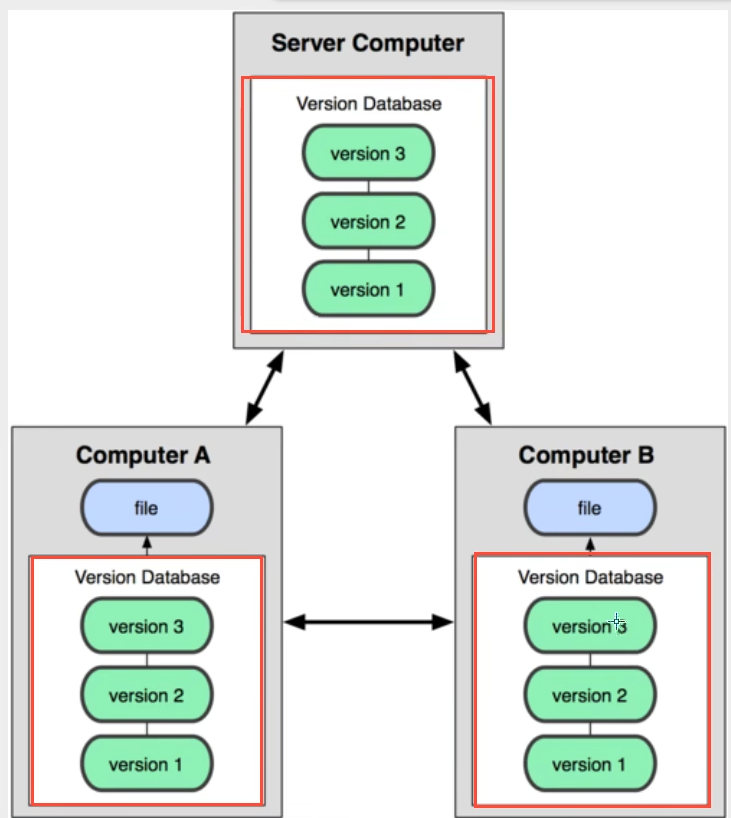
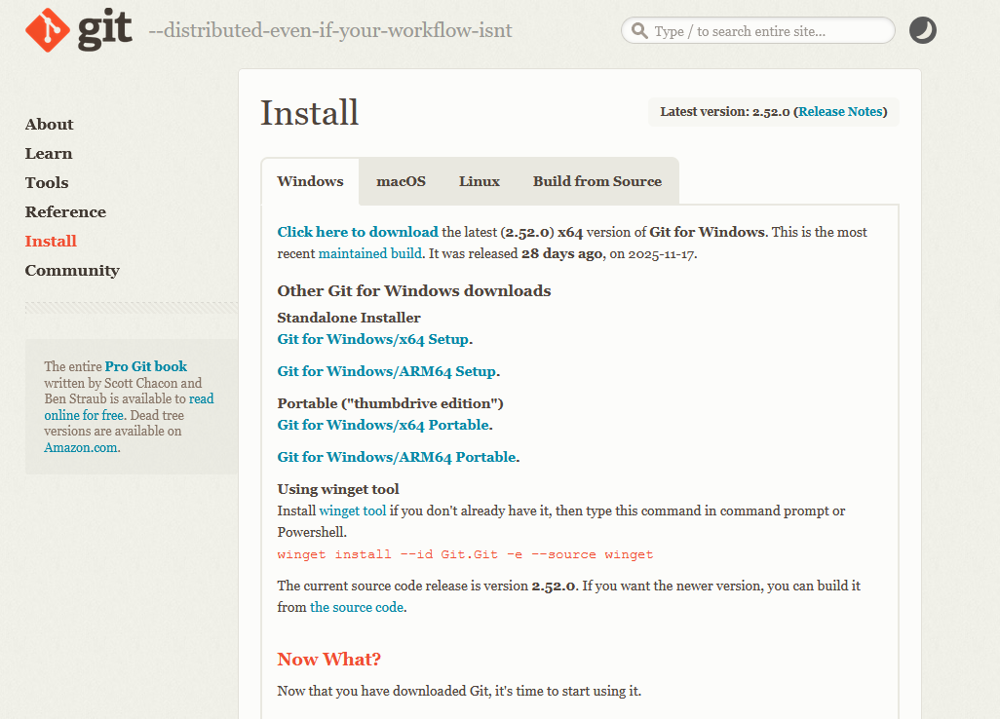
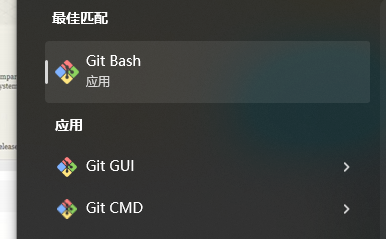
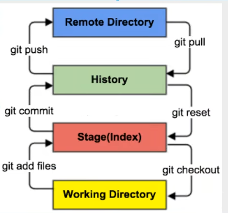
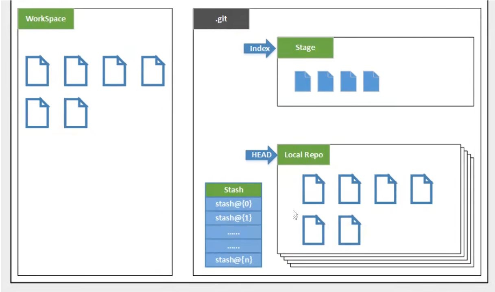
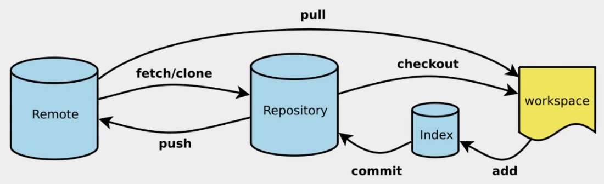

---

## 版本控制

* 版本控制（Revision control）是一种在开发的过程中用于管理我们对文件、目录或工程等内容的修改历史，方便查看更改历史记录，备份以便恢复以前的版本的软件工程技术。

> 版本控制分类

1. 本地版本控制
   * 记录文件每次的更新，可以对每个版本做一个快照，或是记录补丁文件，适合个人用，如RCS。

2. 集中版本控制（**SVN**）
   * 所有的版本数据都保存在服务器上，协同开发者从服务器上同步更新或上传自己的修改
   * 所有的版本数据都存在服务器上，用户的本地只有自己以前所同步的版本，如果不连网的话，用户就看不到历史版本，也无法切换版本验证问题，或在不同分支工作。而且，所有数据都保存在单一的服务器上，有很大的风险这个服务器会损坏，这样就会丢失所有的数据，当然可以定期备份。代表产品：SVN、CVS、VSS

3. 分布式版本控制（**git**）![1765803649981]

   

   * **每个人都拥有全部代码！安全隐患！**
   * 所有版本信息仓库全部同步到本地的每个用户，这样就可以在本地查看所有版本历史，可以离线在本地提交，只需在连网时push到相应的服假务器或其他用户那里。由于每个用户那里保存的都是所有的版本教据，只要有一个用户的设备没有问题就可以恢复所有的数据，但这增加了本地存储空间的占用。
   * **不会因为服务器损坏或者网络问题，造成不能工作的情况！**


## Git环境配置

> [git官网](https://git-scm.com/install/windows)下载git



> 卸载

直接卸载，然后清除环境变量

下载对应版本安装

安装：无脑下一步！安装！


> 启动git



---

> Git 配置

* 所有的配置文件都存在本地！

```
查看配置 git config -l
查看系统配置 git config --system -l
查看用户配置 git config --global -l
```

> ==设置用户名和邮箱（用户标识，必要）==

```
git config --global user.name "kunkun'' #名称
git config --global user.email "123456@qq.com'' #邮箱
```

1. C:\Program Files\Git\etc\gitconfig    (system 配置)
2. C:\Users\Administrator\ .gitconfig （global用户配置）


## Git基本理论（核心）

> 工作区域

Git本地有三个工作区域工作目录（Working Directory），暂存区(Stage/Index)，资源库（Repository或Git Directory)。如果在加上远程的git仓库（Remote Directory）就可以分为四个工作区域。在这四个区域之间的转换关系如下：



* Workspace：工作区，就是你平时存放项目代码的地方
* Index/Stage：暂存区，用于临时存放你的改动，事实上它只是个文件，保存即将提交到文件列表信息
* Repository：仓库区（或本地仓库），就是安全存放数据的位置，这里面有你提交到所有版本的数据。其中HEAD指向最新放入仓库的版本

* Remote：远程仓库，托管代码的服务器，可以简单的认为是你项目组中的一台电脑用于远程数据交换



> 工作流程

Git的工作流程一般是这样的：

1. 在工作目录中添加、修改文件：

2. 将需要进行版本管理的文件放入暂存区域；

3. 将暂存区域的文件提交到git仓库。

   因此，git管理的文件有三种状态：已修改（modified），已暂存（staged），已提交（committed）


## Git项目搭建

> 创建工作目录与常用指令



* **git add .** 
* **git commit**
* **git push**

> 本地仓库搭建

* git init

> 克隆远程仓库

* git clone [url]

## Git文件操作

> 文件4种状态

* **Untracked**: 未跟踪，此文件在文件夹中，但并没有加入到git库，不参与版本控制.通过**git add**状态变为**staged**。
* **Unmodify**: 文件已经入库，未修改，即版本库中的文件快照内容与文件夹中完全一致.这种类型的文件有两种去处，如果它被修改，而变为**Modified**.如果使用**git rm**移出版本库，则成为**Untracked**文件。
* **Modified**: 文件已修改，仅仅是修改，并没有进行其他的操作.这个文件也有两个去处，通过**git add**可进入暂存**staged**状态，使用**git checkout**则丢弃修改过，返回到**unmodify**状态，这个**git checkout**即从库中取出文件，覆盖当前修改！
*  **Staged**: 暂存状态.执行**git commit**则将修改同步到库中，这时库中的文件和本地文件又变为一致，文件为**Unmodify**状态执行**git reset HEAD filename**取消暂存，文件状态为**Modified**。


> 查看文件状态

``` bash
# 查看指定文件状态
git status [filename]

#查看所有文件状态
git status 

git add .                          #添加所有文件到暂存区
git commit -m “消息内容”		   #提交暂存区中的内容到本地仓库  -m  提交信息
```


> 忽略文件

在主目录下建立 .gitignore,有如下规则

```bash
*.txt            #所有以txt结尾的
!lib.txt		#但lib.txt除外
/temp			#不包括temp目录
bulid/			#忽略bulid/下的所有文件
doc/*.txt		#忽略doc下所有txt结尾的文件
```

