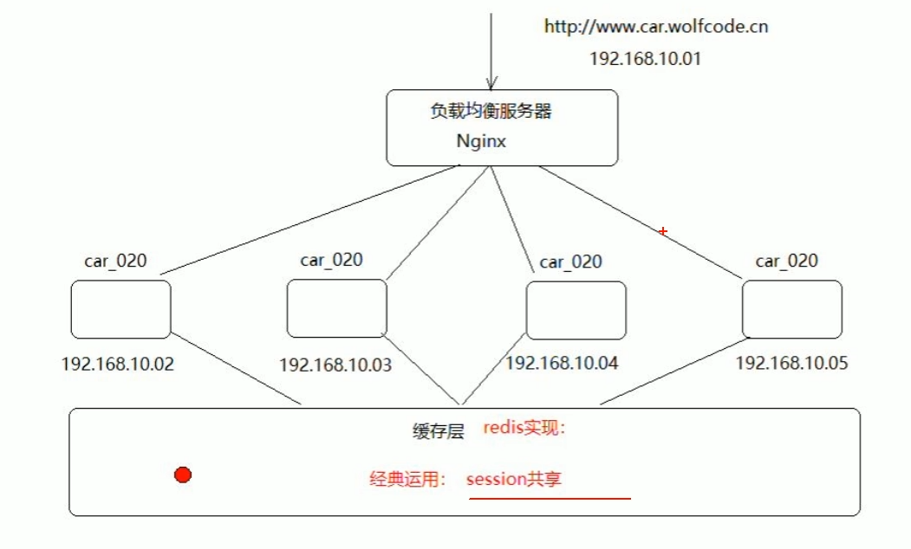
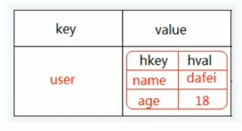
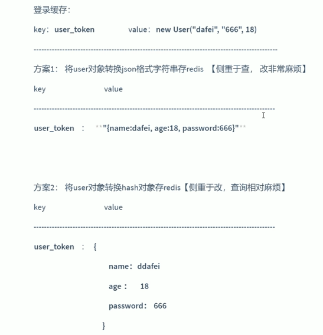
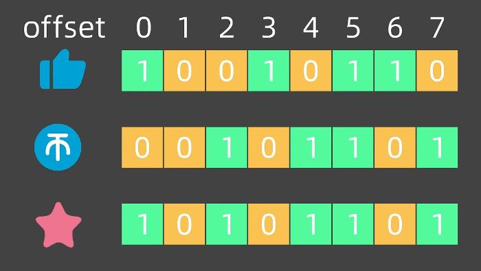
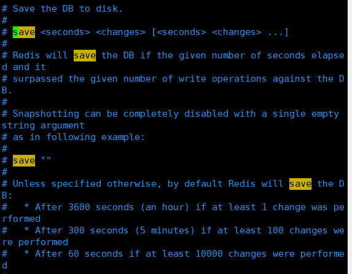

---

title: "Redis"
description: "Explore step-by-step guides that walk you through common tasks, from setup to advanced workflows, helping you learn and use this project with confidence."
summary: ""
date: 2023-09-07T16:06:50+02:00
lastmod: 2023-09-07T16:06:50+02:00
draft: false
weight: 70
toc: true
params:
  seo:
    title: "" # custom title (optional)
    description: "" # custom description (recommended)
    canonical: "" # custom canonical URL (optional)
    robots: "" # custom robot tags (optional)
---

# Redis

### nosql概念

* 把原先io的数据操作变成内存级的操作，具备高并发，高性能的优点

* Redis定位是**缓存**，提高数据读写速度，减轻对数据库存储与访问压力
* redis不建议存敏感数据

---

### 启动

redis-server

redis-cli

---

### 字符串-string

| 命令                    | 功能                                                         |
| ----------------------- | ------------------------------------------------------------ |
| `set name zr`           | 设置键 `name` 的值为 `zr`                                    |
| `get name`              | 获取键 `name` 对应的值                                       |
| ``del key``             | 删除key                                                      |
| ``incr key``            | 将key对应的value值+1                                         |
| ``decr key``            | 将key对应的value值-1                                         |
| `exists name`           | 判断键 `name` 是否存在（存在返回 1，不存在返回 0）           |
| `keys *`                | 查找 Redis 中所有的键                                        |
| `keys *me`              | 查找所有以 `me` 结尾的键                                     |
| `flushall`              | 删除 Redis 中所有的键（慎用）                                |
| `expire name 20`        | 为键 `name` 设置 20 秒的过期时间                             |
| `ttl name`              | 查看键 `name` 的剩余过期时间（-1 永不过期，-2 已过期）       |
| `setex name 5 balabala` | 一次性设置键 `name` 的值为 `balabala`，并指定 5 秒过期时间   |
| `setnx keys value`      | 仅当键 `keys` 不存在时，才将其值设置为 `value`（分布式锁常用） |

**应用:**

* 共享session



---

### 列表-list （L开头）


| 命令                          | 功能                                                         |
| ----------------------------- | ------------------------------------------------------------ |
| `LPUSH key value [value ...]` | 在列表 `key` 的**头部（左侧）** 添加一个或多个元素（支持多值） |
| `RPUSH key value [value ...]` | 在列表 `key` 的**尾部（右侧）** 添加一个或多个元素（支持多值） |
| `LRANGE key start stop`       | 查看列表 `key` 中指定范围的元素示例：`LRANGE letter 0 -1`（查看列表所有内容） |
| `LPOP key [count]`            | 删除并返回列表 `key` 的**头部**元素示例：`LPOP letter 2`（删除头部 2 个元素） |
| `RPOP key [count]`            | 删除并返回列表 `key` 的**尾部**元素示例：`RPOP letter 2`（删除尾部 2 个元素） |
| `LLEN key`                    | 查看列表 `key` 的长度（元素个数）                            |
| `LTRIM key start stop`        | 修剪列表 `key`，仅保留 `start` 到 `stop` 区间的元素示例：`LTRIM letter 1 3`（只保留索引 1-3 的元素） |


---

### 集合-set  （S开头）

| 命令                           | 功能                                                         |
| ------------------------------ | ------------------------------------------------------------ |
| `SADD key member [member ...]` | 向集合 `key` 中添加一个或多个元素（集合自动去重，重复添加无效果）示例：`SADD course redis`（给 course 集合添加 redis 元素） |
| `SMEMBERS key`                 | 查看集合 `key` 中的所有元素示例：`SMEMBERS course`（列出 course 集合的全部元素） |
| `SISMEMBER key member`         | 判断元素 `member` 是否存在于集合 `key` 中（存在返回 1，不存在返回 0）示例：`SISMEMBER course Redis` |
| `SREM key member [member ...]` | 删除集合 `key` 中的一个或多个指定元素示例：`SREM course Redis`（删除 course 集合中的 Redis 元素） |
| ``SPOP key count``             | 从key集合中随机弹出count个元素                               |
| `SINTER key1 [key2 ...]`       | 集合**交集**运算：返回同时存在于 key1、key2 等集合中的元素示例：`SINTER course1 course2`（取两个集合的共同元素） |
| `SUNION key1 [key2 ...]`       | 集合**并集**运算：返回所有出现在 key1、key2 等集合中的元素（去重）示例：`SUNION course1 course2`（合并两个集合的所有元素） |
| `SDIFF key1 [key2 ...]`        | 集合**差集**运算：返回存在于 key1 但不存在于 key2 等集合中的元素示例：`SDIFF course1 course2`（取 course1 有、course2 没有的元素） |


---

### 有序集合 Sorted set（z开头）

| 命令                                       | 功能                                                         |
| ------------------------------------------ | ------------------------------------------------------------ |
| `ZADD key score member [score member ...]` | 向有序集合 `key` 中添加一个 / 多个「分数 - 成员」对（分数为浮点型，可重复；成员唯一）示例：`ZADD result 680 清华 660 北大 650 复旦 640 浙大` |
| `ZRANGE key start stop [WITHSCORES]`       | 按**分数从小到大**查询有序集合 `key` 中指定范围的成员示例：`ZRANGE result 0 -1 WITHSCORES`（查询所有成员并附带分数） |
| `ZSCORE key member`                        | 查询有序集合 `key` 中指定成员的分数示例：`ZSCORE result 清华`（返回 680） |
| `ZRANK key member`                         | 按**分数从小到大**查询成员的排名（排名从 0 开始计数）示例：`ZRANK result 清华`（返回 0，即第 1 名） |
| `ZREVRANK key member`                      | 按**分数从大到小**查询成员的排名（排名从 0 开始计数，rev=reverse 表示反转）示例：`ZREVRANK result 清华`（返回 0，即第 1 名） |
| ``ZCARD key``                              | 获取一个有序集合中成员的数量（基数）                         |

1. 有序集合特性：**成员唯一、分数可重复**，排序核心依据是分数（默认升序）；

2. 命令大小写：`WITHSCORES` 是固定参数（可大写 / 小写），建议统一大写便于识别；

3. 排名计数规则：`ZRANK/ZREVRANK` 的排名从 `0` 开始（如分数最高的成员 `ZRANK` 返回 `0`，`ZREVRANK` 也返回 `0`）。

   

---

### 哈希hash（H开头）

一个 `key` 对应多个「字段（field）- 值（value）」，适合存储对象（如用户、商品信息）；



| 命令                                     | 功能                                                         |
| ---------------------------------------- | ------------------------------------------------------------ |
| `HSET key field value [field value ...]` | 给哈希 `key` 设置一个 / 多个「字段 - 值」对（支持批量设置）<br/>示例 1：`HSET person name laoyang`（设置 person 的 name 字段为 laoyang）<br/>示例 2：`HSET person age 100`（设置 person 的 age 字段为 100） |
| `HGET key field`                         | 获取哈希 `key` 中指定字段的值<br/>示例 1：`HGET person age`（返回 100）<br/>示例 2：`HGET person name`（返回 laoyang） |
| `HGETALL key`                            | 获取哈希 `key` 中所有的「字段 - 值」对（返回结果为字段、值成对出现的列表）示例：`HGETALL person`（返回 ["name","laoyang","age","100"]） |
| `HEXISTS key field`                      | 判断哈希 `key` 中指定字段是否存在（存在返回 1，不存在返回 0）<br/>示例：`HEXISTS person name`（返回 1） |
| ``HDEL key field``                       | 删除key对应的hash列表                                        |
| ``hincrby key field increment``          | 给key对应hash列表中的field进行增量操作<br/>示例：````hincrby user age 1 ```` age的值加1 |
| ``hvals key``                            | 获取key对应的hash列表所有的field对应的value值                |
| `HKEYS key`                              | 获取哈希 `key` 中所有的**字段名**（而非值，修正原文笔误）<br/>示例：`HKEYS person`（返回 ["name","age"]） |
| `HLEN key`                               | 获取哈希 `key` 中「字段 - 值」对的**数量**（而非值的长度，修正原文笔误）<br/>示例：`HLEN person`（返回 2，因为有 name、age 两个字段） |

**应用：**session共享



 

---

### 发布订阅模式

| 命令                        | 功能               |
| --------------------------- | ------------------ |
| ``PUBLISH channel message`` | 发送消息到指定频道 |
| ``SUBSCRIBE``               | 订阅频道           |


---

### 消息队列 stream（x开头）

``xadd zr \* course redis``（添加一个redis的课程）

*表示自动生成一个消息的id

``XLEN zr`` 查看消息数量

``XRANGE zr  -  +``

‘-’,‘+’表示所有消息

``XDEL ZR ID`` 删除消息

**XDEL zr 1773123389918-0**

``XTRIM zr MAXLEN 0`` 删除所有消息

``XADD zr 1-0 course git`` 手动添加id消息队列

注：1-0代表时间戳-序列号，手动指定id需保持递增

 

``XREAD COUNT 2 BLOCK 1000 STREAMS zr 0``（可以重复读取）

COUNT 2 : 一次读取两条消息

BLOCK 1000 ：没有消息就阻塞1000毫秒

STREAMS zr 0：0表示从头开始读取

XREAD COUNT 2 BLOCK 1000 STREAMS zr **$**

($ 读取最新的数据)

``XGROUP CREATE  zr gourp1 0`` 创建消费者组

``XGROUP CREATE  消息名称 组名 id``

``XINFO GROUPS zr`` 查看消费者组的消息

``XGROUP CREATECONSUMER zr group1 consumer1``

（添加消费者到组里）

``XREADGROUP GROUP group1 consumer1 COUNT 2 BLOCK 3000 STREAMS zr >``


| 命令                                                         | 功能                                                         |
| ------------------------------------------------------------ | ------------------------------------------------------------ |
| `XADD key ID field value [field value ...]`                  | 向 Stream `key` 中添加消息<br>示例 1：`XADD zr * course redis`（自动生成 ID，添加 redis 课程消息）<br/>示例 2：`XADD zr 1-0 course git`（手动指定 ID=1-0 添加 git 课程消息，ID 需保持递增） |
| `XLEN key`                                                   | 查看 Stream `key` 中的消息总数量<br/>示例：`XLEN zr`（返回 zr 队列的消息数） |
| `XRANGE key start end`                                       | 读取 Stream `key` 中指定 ID 范围的消息<br/>示例：`XRANGE zr - +`（`-`代表最小 ID，`+`代表最大 ID，读取所有消息） |
| `XDEL key ID`                                                | 删除 Stream `key` 中指定 ID 的消息<br/>示例：`XDEL zr 1773123389918-0`（删除 ID 为 1773123389918-0 的消息） |
| `XTRIM key MAXLEN count`                                     | 修剪 Stream `key`，仅保留指定数量的消息<br/>示例：`XTRIM zr MAXLEN 0`（删除 zr 队列所有消息） |
| `XREAD [COUNT count] [BLOCK ms] STREAMS key [key ...] ID [ID ...]` | 独立读取 Stream 消息（可重复读）<br/>示例 1：`XREAD COUNT 2 BLOCK 1000 STREAMS zr 0`（阻塞 1000ms，从头读取 2 条）<br/>示例 2：`XREAD COUNT 2 BLOCK 1000 STREAMS zr $`（`$`读取最新未读消息） |
| `XGROUP CREATE key groupname ID`                             | 为 Stream `key` 创建消费者组<br/>示例：`XGROUP CREATE zr group1 0`（为 zr 创建 group1 组，从 0 开始消费） |
| `XINFO GROUPS key`                                           | 查看 Stream `key` 下所有消费者组的信息<br/>示例：`XINFO GROUPS zr`（查看 zr 的消费者组列表） |
| `XGROUP CREATECONSUMER key groupname consumername`           | 给指定消费者组添加消费者<br/>示例：`XGROUP CREATECONSUMER zr group1 consumer1`（给 group1 添加 consumer1 消费者） |
| `XREADGROUP GROUP groupname consumername [COUNT count] [BLOCK ms] STREAMS key ID` | 以消费者组模式读取消息（消费后标记为已读，不可重复消费）示例：`XREADGROUP GROUP group1 consumer1 COUNT 2 BLOCK 3000 STREAMS zr >`（`>`表示读取组内未消费的最新消息） |

**关键参数：**

- `COUNT n`：限制单次读取的消息数量；
- `BLOCK ms`：无消息时阻塞指定毫秒（0 表示永久阻塞）；
- `0`：从头读取；`$`：读取最新消息；`>`：组内读取未消费消息；


---

### 地理位置 Geospatial (GEO开头)

``geoadd city 116.405285 39.904989 beijing``

（添加地理位置）（经度，纬度）

``GEOADD city 121.472644 31.231706 shanghai 114.085947 22.547 shenzhen 37 23.125178 quangzhou 120.153576 30.287459 hangzhou``

（添加多个地理位置）

``GEOPOS city beijing ``（获取一个城市坐标）

``GEODIST city beijing shanghai`` （两个城市之间的距离，单位默认**米**）

``GEODIST city beijing shanghai km`` (单位为千米)

``GEOSEARCH city FROMMEMBER shanghai BYRADIUS 300 KM`` （返回以自身为中心300km的城市）

``BYBOX`` 以矩形的范围


| 命令语法                                                     | 功能说明                                                     |
| ------------------------------------------------------------ | ------------------------------------------------------------ |
| `GEOADD key longitude latitude member [longitude latitude member ...]` | 向 GEO 集合 `key` 中添加一个 / 多个「经度 - 纬度 - 地点」映射（经度在前，纬度在后）<br/>示例 1：`GEOADD city 116.405285 39.904989 beijing`（添加北京坐标）<br/>示例 2：`GEOADD city 121.472644 31.231706 shanghai 114.085947 22.547 shenzhen 37 23.125178 quangzhou 120.153576 30.287459 hangzhou`（批量添加多城市坐标） |
| `GEOPOS key member [member ...]`                             | 获取 GEO 集合 `key` 中指定地点的经纬度坐标<br/>示例：`GEOPOS city beijing`（返回北京的 [经度，纬度] 数组） |
| `GEODIST key member1 member2 [unit]`                         | 计算两个地点之间的直线距离，支持指定单位（默认单位：米）<br/>示例 1：`GEODIST city beijing shanghai`（默认米为单位）<br/>示例 2：`GEODIST city beijing shanghai km`（指定千米为单位） |
| `GEOSEARCH key FROMMEMBER member BYRADIUS radius unit`       | 以指定地点为中心，搜索指定半径范围内的所有地点<br/>示例：`GEOSEARCH city FROMMEMBER shanghai BYRADIUS 300 KM`（搜索以上海为中心 300 千米内的城市） |
| `GEOSEARCH key FROMMEMBER member BYBOX width height unit`    | 以指定地点为中心，搜索矩形范围内的所有地点（BYBOX = 按矩形范围）<br/>示例：`GEOSEARCH city FROMMEMBER shanghai BYBOX 200 100 KM`（搜索以上海为中心、宽 200km× 高 100km 矩形内的城市） |


---

### HyperLoglog （PF开头）

* 一种做基数统计的算法

如果集合中的每个元素都是唯一且不重复的

那么这个集合的基数就是集合中元素的个数

* 优点：内存占用小，省空间

* 缺点：有一定误差，精确度低

* 作用：精确度要求不高，数据量非常大的统计工作

``PFADD course git docker redis`` 添加元素

``PFCOUNT course`` 查看基数数量

``PFMERGE result course course2`` 合并两个hyperloglog 


---

### 位图 Bitmap （BIT结尾）

``SETBIT dianzan 0 1`` 把点赞的0位置设置成1

``SETBIT dianzan 0 1`` 把点赞的1位置设置成0



``BITCOUNT dianzan`` 统计多少bit是1

``BITPOS dianzan 0`` 第一个出现的0或者1的位置

``BITPOS dianzan 0 2 5 [BYTE|BIT]``（找第二到第五**位**0出现的偏移值）

[BYTE|BIT]按照字节或位来找


---

### 位域 Bitfield

> （存储角色等级、金币、装备位）

``BITFIELD player:1 set u8 #0 1``

（设置一个玩家；u8 8位整数 #0 0号位置为1）

``get player:1`` 查看内存的信息
``BITFIELD player:1 get u8 #0``

（查看0号位置的值）

``BITFIELD player:1 set u32 #1 100 ``

（设置玩家1号位置为1）

``BITFIELD player:1 get u32 #1 100 ``
``BITFIELD player:1 get u32 #1 ``

（设置一个玩家；u32 32位整数 #1 1号位置为100）

``BITFIELD player:1 incrby u32 #1 100 ``

（incrby ：增加；1号位置增加100）

``BITFIELD player:1 incrby u8 #0 1 ``

(0号位置增加1)


---

### redis事务

```
MULTI

​	SET

​	LPUSH

​	SSADD

EXEC
```

注：命令如果有错误，其他命令还会正常执行

* 在事务执行过程，其他客户端提交的命令请求不 会插入到事务执行命令序列中

---

### redis持久化

``save`` 保存数据

* RDB （适合备份，定时备份）
* AOF

RDB: 

``vim redis.conf``

save 秒数 修改次数



 也可以手动**save**触发快照

* bgsave 单独创建子进程进行数据写入，主进程可继续处理请求


**AOF** (追加文件)

* 以日志的方式写入文件，在redis启动时执行，重新执行AOF文件的命令重建一个数据库

将redis.conf的 appendonly改为yes

``appendonly yes ``


---

### 主从复制

* 一台redis服务器的数据复制到另一台
* 主节点到从节点（主节点只有一个，从节点可以有多个）

* 单向，只能由主节点到从节点

**命令行配置**（了解）

``replicaof <host> <port>`` 指定主节点的ip和端口

**配置文件配置**

port 6380

pidfile /var/run/redis_6380.pid

dbfilename dump-6380.rdb （持久化文件）

replicaof 127.0.0.1 6379 配置从节点

配置 `masterauth` 密码验证

``:1,$/6380/6381/g  `` 快速搭建从节点

info replication 查看详细信息


---

### 哨兵模式

* 哨兵模式会以独立的进程运行在redis集群中，不断发送ping命令，检查节点是否存活。
* 通过发布订阅模式，通知其他节点
* 故障转移，主节点不能工作时，转移主节点

```shell
sentinel monitor master 127.0.0.1 6379 1                               
               主节点名称  ip地址  端口号 

1：只需一个哨兵节点同意
```

哨兵节点需要配置密码

实际使用三个哨兵节点保持高可用，通过选举方式选出主节点


---

### Value 设计

value值的设计其实就是value类型选用：String,Hash,List,Set,Sort Set
一般考虑：

* 是否需要排序？要使用Sort Set
* 缓存的数据是多个值还是单个值，
* 多个值：允许重复选List不允许重复选择Set
* 单个值：简单值选择String,对象值选择Hash


一种取巧的方式：

* 是否需要排序？要使用Sort Set
* 剩下使用String

操作方式：
	所有value之后都转换成json格式字符串，然后缓存到Redis,原因：Java操作方便，减少泛型操作麻烦


---

### Redis全局命令 

| 命令格式             | 功能描述                                                     | 案例                  |
| -------------------- | ------------------------------------------------------------ | --------------------- |
| `keys pattern`       | 按 pattern 匹配规则，列出 Redis 中所有的 key（**生产环境慎用，会阻塞主线程**） | `keys xxx:*`          |
| `exists key`         | 判断 key 是否存在（存在返回 1，不存在返回 0）                | `exists name`         |
| `expire key seconds` | 给 key 设置过期时间，单位为秒（seconds）                     | `expire name 10`      |
| `persist key`        | 取消 key 的过期时间，使其永久有效                            | `persist name`        |
| `select index`       | 切换数据库，默认是第 0 个，Redis 默认有 0~15 共 16 个数据库  | `select 0`            |
| `move key db`        | 将当前数据库中的 key 移动到指定的 db 数据库（目标库不存在该 key 才会成功） | `move name 1`         |
| `randomkey`          | 随机返回一个当前数据库中的 key                               | `randomkey`           |
| `rename key newkey`  | 将 key 重命名为 newkey（若 newkey 已存在则会覆盖）           | `rename name newname` |
| `echo message`       | 打印输入的 message 信息（用于测试连接）                      | `echo message`        |
| `dbsize`             | 查看当前数据库中 key 的总数量                                | `dbsize`              |
| `info`               | 查看 Redis 服务器的详细运行信息（内存、客户端、持久化等）    | `info`                |
| `config get *`       | 查看所有 Redis 配置项信息（也可指定单个配置，如 `config get port`） | `config get *`        |
| `flushdb`            | 清空**当前数据库**中的所有 key（谨慎操作，不可恢复）         | `flushdb`             |
| `flushall`           | 清空**所有数据库**中的所有 key（极度危险，生产环境需严格权限控制） | `flushall`            |


---

### Redis 内存淘汰算法

| 算法类型     | 全称                  | 核心逻辑                                                 | 关联因素               | 通俗理解                                 |
| ------------ | --------------------- | -------------------------------------------------------- | ---------------------- | ---------------------------------------- |
| **LRU**      | Least Recently Used   | 删除**最近最少使用**的数据，即最长时间未被访问的 key     | 仅与**时间**相关       | “很久没碰过的东西，大概率以后也不会用了” |
| **LFU**      | Least Frequently Used | 删除一段时间内**使用次数最少**的数据                     | 与**频次 + 时间**相关  | “用得越少的东西，越该被清理”             |
| **TTL**      | Time To Live          | 优先删除**即将过期**的 key（仅针对设置了过期时间的数据） | 与**剩余过期时间**相关 | “快到期的东西，内存不够就先清掉”         |
| **随机淘汰** | -                     | 随机选择 key 进行删除                                    | 无，完全随机           | “生死有命，全凭运气”                     |

